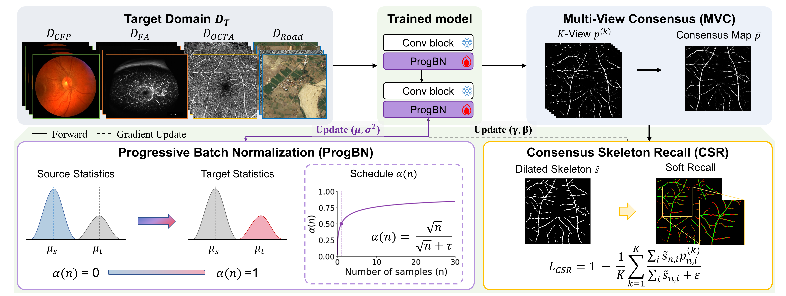

# SGP-TTA

**Skeleton-Guided Progressive Test-Time Adaptation for Tubular-Structure Segmentation**

<div align="center">
  
</div>

SGP-TTA is a single-image test-time adaptation (TTA) wrapper for segmentation
networks that predict *tubular* structures — retinal vessels, OCTA
microvasculature, roads in aerial imagery, and similar. It adapts a
source-domain model to each incoming target-domain image without any labels
and without touching the training pipeline.

## Method

The method has two ingredients:

1. **Progressive Batch Normalization (ProgBN).** Every `nn.BatchNorm2d` layer
   in the source model is replaced by a layer that blends the frozen source
   running statistics with the current-batch target statistics using a
   monotonic square-root warmup:

   $$\alpha_n = \frac{\sqrt{n}}{\sqrt{n} + \tau}, \qquad \mu = \alpha_n\, \mu_{\text{target}} + (1 - \alpha_n)\, \mu_{\text{source}}$$

   Small `tau` warms up quickly; large `tau` stays anchored to source
   statistics for longer.

2. **Skeleton-Guided objective.** For each incoming image we form six
   augmented views (identity, two flips, three 90-degree rotations), average
   their per-view predictions into a **Multi-View Consensus (MVC)** map, and
   update only the BN affine parameters (`gamma`, `beta`) with two losses:

   - **Consensus entropy** on the mean prediction.
   - **Consensus Skeleton Recall (CSR) loss** — skeletonize the binarized
     consensus, dilate it into a thin tube, and penalize `1 - recall` of each
     view's probability against that tube. This anchors the network to the
     structural centerline and keeps thin branches from being erased by the
     entropy pressure toward confident predictions.

## Environment

Requires Python 3.9+. Install dependencies with:

```bash
pip install -r requirements.txt
```

Tested with:
```
Python 3.9
PyTorch 2.6.0 + CUDA 12.2
segmentation-models-pytorch 0.3
```

## Pre-trained models

Source-domain checkpoints are too large to bundle with the repository.
Download them from Google Drive, create a `model/` folder at the repository
root, and place the `.pth` file(s) inside:

- [Google Drive — SGP-TTA pre-trained models](https://drive.google.com/drive/folders/1RthfZFowUyZrVSFbEcmVFuGmCqXa53VP?usp=drive_link)

```bash
mkdir -p model
# move the downloaded DRIVE_unet.pth into ./model/
```

Expected layout after download:
```
model/
└── DRIVE_unet.pth   # smp.Unet (resnet50 encoder), trained on DRIVE retinal vessels
```

## Quick start

Once the checkpoint is in `model/`, open [`examples.ipynb`](examples.ipynb)
and run it top to bottom. It loads `model/DRIVE_unet.pth`, runs a
**Source-only** prediction on each sample, then runs **SGP-TTA** on the
same stream and shows the two predictions side by side. If you want to use
a different checkpoint, edit `CHECKPOINT_PATH` at the top of the notebook.

## Usage

`SGPTTA` is model-agnostic — it works on any segmentation network that emits
raw logits (or a tuple whose first element is logits) and contains
`nn.BatchNorm2d` layers.

```python
import torch
from sgp_tta import SGPTTA

model = build_your_segmentation_network()          # e.g. U-Net with BN
model.load_state_dict(torch.load('source.pth'))
model = model.to('cuda').eval()

tta = SGPTTA(
    model,
    temperature=5.0,       # ProgBN warmup tau
    lr=1e-3,               # Adam LR for BN affine params
    num_steps=1,           # gradient steps per image
    entropy_weight=1.0,    # weight of consensus entropy loss
    skeleton_weight=1.0,   # weight of consensus skeleton recall loss
    dilate_radius=2,       # disk radius for skeleton dilation
)

for image in target_stream:                        # shape [1, C, H, W]
    logits = tta(image.to('cuda'))                 # adapted logits
    pred = (torch.sigmoid(logits) > 0.5).float()

# Call reset() before adapting to a new target domain:
tta.reset()
```

### What gets updated

- **Trainable:** BN affine parameters (`gamma`, `beta`) only.
- **Frozen:** all conv/linear weights, all bias terms outside BN, both
  running statistics buffers.
- **Blended per forward:** the batch mean/variance used inside each ProgBN
  layer, following the warmup schedule.

### Notes

- The wrapper modifies `model` **in place** (its `BatchNorm2d` layers are
  swapped for `ProgBN`). If you need to keep an untouched copy of the source
  model, deep-copy it before wrapping.
- `SGPTTA.__call__` returns adapted **logits**, so downstream code can keep
  applying `torch.sigmoid` and thresholding.
- Small `temperature` (e.g. `1`) warms up quickly and is good for streams
  where the target domain is well-represented after only a handful of
  images. Larger `temperature` (e.g. `5`) stays anchored to source
  statistics for longer, which helps on noisier or more shifted targets.

## Repository layout

```
SGPTTA/
├── sgp_tta.py         # ProgBN + SGPTTA (the whole method)
├── examples.ipynb     # single-stream inference demo
├── model/             # place downloaded checkpoint(s) here (see Pre-trained models)
│   └── DRIVE_unet.pth

├── sample/            # example target-domain images
├── overview.png
├── requirements.txt
├── LICENSE
└── README.md
```

## Citation

If this code is helpful for your research, please cite:

```bibtex
@article{sgptta2026,
  title={Skeleton-Guided Progressive Test-Time Adaptation for Tubular-Structure Segmentation},
  author={SGP-TTA authors},
  year={2026}
}
```

## License

See [`LICENSE`](LICENSE).
